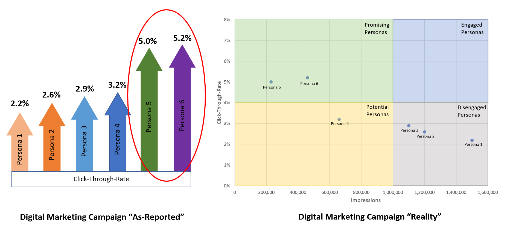

#### 2019-07-05 CORe Connections 01

##### Instructions:

Share and describe an image that depicts a visual representation of data. Briefly explain why you think this representation is particularly interesting or effective. You can create your own representation or find an example.

##### Shared:

Recently I had the chance to be involved in a digital marketing campaign for my company to identify and target buyer personas with likely purchase intent. We had agreed to use click-through-rate (CTR) as one of the metrics to measure success of the campaign, i.e. number of clicks divided by impressions (number of times the ad is shown). The target CTR is at least 4%.

The marketing agency reported the CTR results in one of our meetings (left diagram) where they showed that they have achieved the target CTR with 2 of the personas. However, the impressions were not reported in the left diagram. I created the right diagram in a form which I think is much more meaningful, taking into consideration of impressions served, since the number of impressions is important in terms of market size (it has to reach enough people to result in significant sales). As a rule-of-thumb I set the target impressions to be at least 1 million. I coined the following terminologies in the chart. The idea is to move points towards the top-right corner.  

* Engaged personas (likely to be customers)  
* Disengaged personas (unlikely to be customers)  
* Promising personas (promising but insufficient reach)  
* Potential personas (indifferent and insufficient reach)  

Note: Not actual numbers from the campaign.