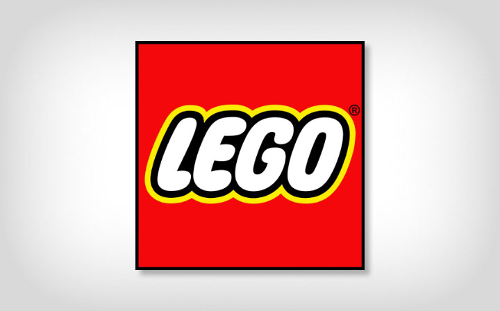

#### 2019-07-29 CORe Connections 05

##### Instructions:

Choose and describe a business that would have a significant amount of inventory and share a photo of that business (or company logo). Briefly explain whether you expect the business uses a periodic or perpetual inventory system, and why. 

If the image is not your own, be sure to cite the source in your description.

##### Shared:

My chosen example is the LEGO Group, which is a privately- and family-owned global business headquartered in Denmark. The company is the maker of plastic toys, what is known widely as Lego bricks to all of us, that allows children (mostly) to use their creativity to interlock these plastic bricks to create various shapes of toys. I think the toy business is still the company’s primary line of business while the company has also a presence in other lines of businesses.

I would imagine that the company would have a tremendous amount (in terms of units) of inventory in the form of Lego bricks in their inventory. Since the company is the maker of the Lego bricks, within their inventory they should include raw materials, work in progress and finished goods. The huge amount of finished goods (not to mention also raw materials and work in progress) should make it quite difficult and labor intensive to perform counts of inventory at Lego. I think the company very likely uses a perpetual inventory system, and only perform periodic inventory counts to account for inventory shrinkage. I think there is no benefit to the company to adopt a periodic inventory system.

Note: The logo of Lego is taken from the LEGO Group’s official website ([the LEGO Group, 2019](www.lego.com))