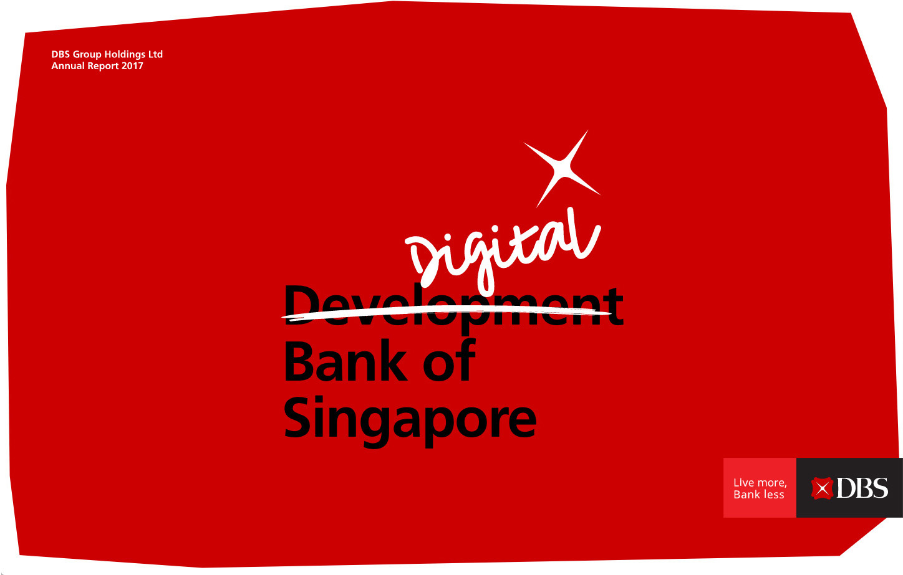

#### 2019-08-03 CORe Connections 06

##### Instructions:

In Economics module 3, we spent some time analyzing the structure of costs (for example, fixed versus variable costs). In particular, we discussed the significance of _fixed costs_, and how the implications of fixed costs differ across businesses, depending on “where they reside” - that is, depending on whether the fixed costs are local, regional, national, or global in nature. Select and describe one important fixed cost incurred by a business and share a photo representing that cost. Explain “where this fixed cost resides” (i.e., how well you think this fixed cost would scale as the business expanded). Please try to think of examples we have not covered in this module.
If the image is not your own, be sure to cite the source in your description.

##### Shared:

The example I have chosen for a fixed cost is the information technology associated with digital banking services by a Singaporean bank, Development Bank of Singapore (DBS). DBS grew as a dominant local bank in Singapore to be South East Asia’s largest bank (DBS Group Holdings, [2017 Annual Report](https://www.dbs.com/annualreports/2017/pdfs/DBS-AR17-full.pdf)). In the past, the fixed cost that allowed it to grow is primarily the physical infrastructure e.g. ATMs and office branches across the whole of Singapore, and it has had to incur the same fixed costs associated with the physical infrastructure for its expansion to other countries.

In 2017, DBS called themselves the “_Digital Bank of Singapore_” as a symbol of its commitment in providing digital banking services to its customers (DBS Group Holdings, [2017 Annual Report](https://www.dbs.com/annualreports/2017/pdfs/DBS-AR17-full.pdf)). In committing to be a digital bank, it has committed to maintaining two different infrastructures associated with digital banking and the more traditional physical banking services (similar to the transition period faced by Penguin Random House). The fixed costs associated with the information technology allow it to operate at the international scale efficiently, like it has done in expanding to Indonesia and India, according to the same 2017 annual report. While on the other hand, it continues to maintain its infrastructure associated with the more traditional way of banking in Singapore and countries where it has already established a presence.

 

Note: The picture is taken from the official website of DBS (DBS Group Holdings, 2019, [www.dbs.com](www.dbs.com))